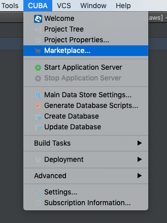
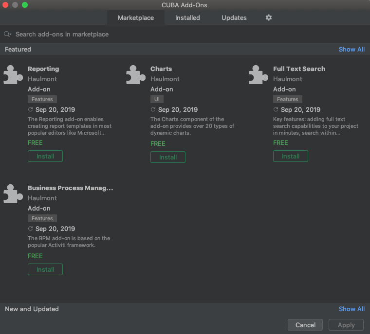
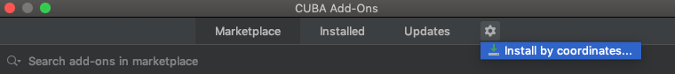

[](http://www.apache.org/licenses/LICENSE-2.0)

## Overview

CUBA Amazon Add-on enables using supported AWS services, for now it supports:
* Amazon Simple Storage Service (S3)

## Installation

The add-on can be added to your project in one of the ways described below. Installation from the Marketplace is the simplest way. The last version of the add-on compatible with the used version of the platform will be installed. 
Also, you can install the add-on by coordinates choosing the required version of the add-on from the table.

In case you want to install the add-on by manual editing or by building from sources see the complete add-ons installation guide in [CUBA Platform documentation](https://doc.cuba-platform.com/manual-latest/manual.html#app_components_usage).
## From the Marketplace

1. Open your application in CUBA Studio. Check the latest version of CUBA Studio on the [CUBA Platform site](https://www.cuba-platform.com/download/previous-studio/).
2. Go to *CUBA -> Marketplace* in the main menu.




3. Find the <add-on name> add-on there.




4. Click *Install* and apply the changes.
The add-on corresponding to the used platform version will be installed.

## By coordinates

1. Open your application in CUBA Studio. Check the latest version of CUBA Studio on the [CUBA Platform site](https://www.cuba-platform.com/download/previous-studio/).
2. Go to *CUBA -> Marketplace* in the main menu.
3. Click the icon in the upper-right corner.




4. Paste the add-on coordinates in the corresponding field as follows:

`com.haulmont.addon.dashboard:dashboard-global:<add-on version>`

where `<add-on version>` is compatible with the used version of the CUBA platform.

| Platform Version | Add-on Version |
|------------------|----------------|
| 7.2.X            | 1.0.0          |

5. Click *Install* and apply the changes. The add-on will be installed to your project.

## Amazon S3 File Storage configuration

 Add the following line into `spring.xml`:
 ```xml
     <bean name="cuba_FileStorage" class="com.haulmont.addon.cubaaws.s3.AmazonS3FileStorage"/>
 ```

 Add the following properties into `app.properties`:

 * **cuba.amazonS3.accessKey**: Amazon S3 access key

 * **cuba.amazonS3.secretAccessKey**: Amazon S3 secret access key

 * **cuba.amazonS3.region**: Amazon S3 region

 * **cuba.amazonS3.bucket**: Amazon S3 bucket name

 * **cuba.amazonS3.chunkSize** (optional): Amazon S3 chunk size

 **Example:**
 ```ini
 cuba.amazonS3.accessKey = AAAABBBBCCCCDD11CC22
 cuba.amazonS3.secretAccessKey = AbCD+eFFGK3iAB9Ca9BCAB7ddDDABcabCabc9aBC
 cuba.amazonS3.region = eu-north-1
 cuba.amazonS3.bucket = s3-ec2-test
 cuba.amazonS3.chunkSize = 5500
 ```